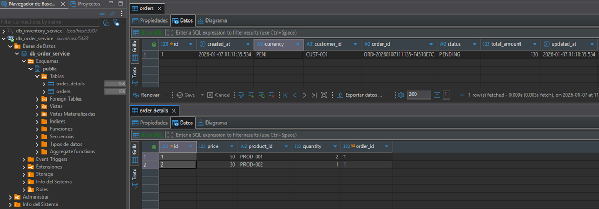

# SAGA Choreography | Distributed Transaction

#### Referencias tomadas para este proyecto:

- Java Tech Solutions
    - Tutorial:
      [Microservices Architecture Patterns | SAGA Design Pattern| Project Creation| Distributed Transaction](https://www.youtube.com/watch?v=WGI_ciUa3FE)
    - Repositorio: [distributed-transaction](https://github.com/JavaaTechSolutions/distributed-transaction)

- Java Techie:
    - Tutorial:
      [Saga Choreography in Microservices 🔥 Movie Ticket Booking System Explained](https://www.youtube.com/watch?v=q38plWv6h5U)
    - Repositorio: [saga-choreography](https://github.com/Java-Techie-jt/saga-choreography)

---

## Docker Compose

````yml
services:
  s-kafka-saga:
    image: apache/kafka:4.1.0
    container_name: c-kafka-saga
    restart: unless-stopped
    ports:
      - '9092:9092'
    environment:
      # Settings required for KRaft mode
      KAFKA_NODE_ID: 1
      KAFKA_PROCESS_ROLES: broker,controller
      KAFKA_CONTROLLER_LISTENER_NAMES: CONTROLLER
      KAFKA_CONTROLLER_QUORUM_VOTERS: 1@localhost:9091
      # Configure listeners for both docker and host communication
      KAFKA_LISTENERS: CONTROLLER://localhost:9091,HOST://0.0.0.0:9092,DOCKER://0.0.0.0:9093
      KAFKA_ADVERTISED_LISTENERS: HOST://localhost:9092,DOCKER://s-kafka:9093
      KAFKA_LISTENER_SECURITY_PROTOCOL_MAP: CONTROLLER:PLAINTEXT,DOCKER:PLAINTEXT,HOST:PLAINTEXT
      # Listener to use for broker-to-broker communication
      KAFKA_INTER_BROKER_LISTENER_NAME: DOCKER
      # Required for a single node cluster
      KAFKA_OFFSETS_TOPIC_REPLICATION_FACTOR: 1
    networks:
      - saga-net

  s-postgres-order:
    image: postgres:17-alpine
    container_name: c-postgres-order
    restart: unless-stopped
    ports:
      - '5433:5432'
    environment:
      POSTGRES_DB: db_order_service
      POSTGRES_USER: order_service_user
      POSTGRES_PASSWORD: order_service_pass
    volumes:
      - postgres-order-data:/var/lib/postgresql/data
    networks:
      - saga-net

  s-postgres-payment:
    image: postgres:17-alpine
    container_name: c-postgres-payment
    restart: unless-stopped
    ports:
      - '5434:5432'
    environment:
      POSTGRES_DB: db_payment_service
      POSTGRES_USER: payment_service_user
      POSTGRES_PASSWORD: payment_service_pass
    volumes:
      - postgres-payment-data:/var/lib/postgresql/data
    networks:
      - saga-net

  s-mysql-inventory:
    image: mysql:8.0.41-debian
    container_name: c-mysql-inventory
    restart: unless-stopped
    ports:
      - '3307:3306'
    environment:
      MYSQL_DATABASE: db_inventory_service
      MYSQL_ROOT_PASSWORD: root_pass
      MYSQL_USER: inventory_service_user
      MYSQL_PASSWORD: inventory_service_pass
    volumes:
      - mysql-inventory-data:/var/lib/mysql
    networks:
      - saga-net

volumes:
  postgres-order-data:
    name: postgres-order-data
  postgres-payment-data:
    name: postgres-payment-data
  mysql-inventory-data:
    name: mysql-inventory-data

networks:
  saga-net:
    name: saga-net
````

Levantamos contenedores

````bash
D:\programming\spring\02.youtube\17.java_tech_solutions\saga-choreography (main -> origin)
$ docker compose -f ./docker/compose.yml up -d                                            
[+] Running 8/8                                                                           
 ✔ Network saga-net              Created                                                  
 ✔ Volume mysql-inventory-data   Created                                                  
 ✔ Volume postgres-order-data    Created                                                  
 ✔ Volume postgres-payment-data  Created                                                  
 ✔ Container c-kafka-saga        Started                                                  
 ✔ Container c-postgres-order    Started                                                  
 ✔ Container c-postgres-payment  Started                                                  
 ✔ Container c-mysql-inventory   Started                                                   
````

Verificamos ejecución de contenedores

````bash
$ docker container ls -a
CONTAINER ID   IMAGE                 COMMAND                  CREATED         STATUS         PORTS                                         NAMES
de41be881f1c   postgres:17-alpine    "docker-entrypoint.s…"   4 minutes ago   Up 4 minutes   0.0.0.0:5434->5432/tcp, [::]:5434->5432/tcp   c-postgres-payment
dc0cca1378d5   mysql:8.0.41-debian   "docker-entrypoint.s…"   4 minutes ago   Up 4 minutes   0.0.0.0:3307->3306/tcp, [::]:3307->3306/tcp   c-mysql-inventory
30f40521aa9a   apache/kafka:4.1.0    "/__cacert_entrypoin…"   4 minutes ago   Up 4 minutes   0.0.0.0:9092->9092/tcp, [::]:9092->9092/tcp   c-kafka-saga
a7e7858d3f75   postgres:17-alpine    "docker-entrypoint.s…"   4 minutes ago   Up 4 minutes   0.0.0.0:5433->5432/tcp, [::]:5433->5432/tcp   c-postgres-order 
````

---

# 📋 Order Service

---

## Dependencias

Creamos el proyecto desde
[Spring Initializr](https://start.spring.io/#!type=maven-project&language=java&platformVersion=3.5.9&packaging=jar&configurationFileFormat=yaml&jvmVersion=21&groupId=dev.magadiflo&artifactId=order-service&name=order-service&description=Demo%20project%20for%20Spring%20Boot&packageName=dev.magadiflo.order.app&dependencies=web,data-jpa,lombok,postgresql,kafka,validation)
con las siguientes dependencias:

````xml
<!--Spring Boot 3.5.9-->
<!--Java 21-->
<dependencies>
    <dependency>
        <groupId>org.springframework.boot</groupId>
        <artifactId>spring-boot-starter-data-jpa</artifactId>
    </dependency>
    <dependency>
        <groupId>org.springframework.boot</groupId>
        <artifactId>spring-boot-starter-validation</artifactId>
    </dependency>
    <dependency>
        <groupId>org.springframework.boot</groupId>
        <artifactId>spring-boot-starter-web</artifactId>
    </dependency>
    <dependency>
        <groupId>org.springframework.kafka</groupId>
        <artifactId>spring-kafka</artifactId>
    </dependency>

    <dependency>
        <groupId>org.postgresql</groupId>
        <artifactId>postgresql</artifactId>
        <scope>runtime</scope>
    </dependency>
    <dependency>
        <groupId>org.projectlombok</groupId>
        <artifactId>lombok</artifactId>
        <optional>true</optional>
    </dependency>
    <dependency>
        <groupId>org.springframework.boot</groupId>
        <artifactId>spring-boot-starter-test</artifactId>
        <scope>test</scope>
    </dependency>
    <dependency>
        <groupId>org.springframework.kafka</groupId>
        <artifactId>spring-kafka-test</artifactId>
        <scope>test</scope>
    </dependency>
</dependencies>
````

## Propiedades de configuración

````yml
server:
  port: 8081
  error:
    include-message: always

spring:
  application:
    name: order-service
  datasource:
    url: jdbc:postgresql://localhost:5433/db_order_service
    username: order_service_user
    password: order_service_pass
  jpa:
    hibernate:
      ddl-auto: update
    properties:
      hibernate:
        format_sql: true
  kafka:
    # bootstrap-servers: Dirección del broker de Kafka
    bootstrap-servers: localhost:9092

    # PRODUCER Configuration
    producer:
      # key-serializer: Serializa la key del mensaje (orderId en nuestro caso)
      key-serializer: org.apache.kafka.common.serialization.StringSerializer
      # value-serializer: Serializa el evento completo a JSON
      value-serializer: org.springframework.kafka.support.serializer.JsonSerializer

    # CONSUMER Configuration
    consumer:
      # group-id: Identifica el grupo de consumidores
      # Consumidores del mismo grupo balancean la carga de mensajes
      group-id: order-service-group
      # auto-offset-reset: Define desde dónde leer si no hay offset guardado
      # - earliest: Lee desde el inicio del tópico
      # - latest: Lee solo mensajes nuevos
      # - none: Lanza excepción si no hay offset
      auto-offset-reset: earliest
      # key-deserializer: Deserializa la key del mensaje
      key-deserializer: org.apache.kafka.common.serialization.StringDeserializer
      # value-deserializer: Deserializa el JSON a objeto Java
      value-deserializer: org.springframework.kafka.support.serializer.JsonDeserializer
      # properties: Configuraciones adicionales del consumer
      properties:
        # spring.json.trusted.packages: Paquetes confiables para deserialización
        # "*" permite deserializar cualquier clase (solo para desarrollo)
        spring.json.trusted.packages: '*'

logging:
  level:
    org.hibernate.SQL: debug
    dev.magadiflo: debug
````

## Modelos

````java
public enum Status {
    PENDING,            // Orden creada, esperando tod el flujo
    PAYMENT_CONFIRMED,  // Pago confirmado
    COMPLETED,          // Happy path final
    CANCELLED           // Falló algo
}
````

````java
public enum Currency {
    USD,
    EUR,
    PEN
}
````

````java
public enum EventType {
    ORDER_CREATED
}
````

## Entidades

### Order

````java

@ToString(exclude = "orderDetails") // Excluimos orderDetails para evitar recursividad en logs o debugging.
@NoArgsConstructor
@AllArgsConstructor
@Builder
@Setter
@Getter
@Entity
@Table(name = "orders")
public class Order {
    @Id
    @GeneratedValue(strategy = GenerationType.IDENTITY)
    private Long id;

    @Column(unique = true, nullable = false, length = 50)
    private String orderCode;

    @Column(nullable = false, length = 50)
    private String customerCode;

    @Column(nullable = false, precision = 10, scale = 2)
    private BigDecimal totalAmount;

    @Enumerated(EnumType.STRING)
    @Column(nullable = false, length = 3)
    private Currency currency;

    @Enumerated(EnumType.STRING)
    @Column(nullable = false, length = 20)
    private Status status;

    /**
     * @CreationTimestamp: Cuando haces un repository.save(order), Hibernate genera un INSERT. 
     * Justo antes de enviarlo, mira el reloj del servidor y llena el campo createdAt. 
     * Al tener updatable = false, Hibernate ignorará cualquier intento posterior de cambiar esa fecha.
     */
    @CreationTimestamp
    @Column(nullable = false, updatable = false)
    private LocalDateTime createdAt;

    /**
     * @UpdateTimestamp: Cada vez que la entidad esté en estado "Managed" (gestionada) y 
     * detecte un cambio en cualquier campo, Hibernate generará un UPDATE e 
     * incluirá la nueva fecha en updatedAt.
     *
     * Cuando haces el primer save() @UpdateTimestamp también le asigna la fecha actual a updatedAt.
     */
    @UpdateTimestamp
    @Column(nullable = false)
    private LocalDateTime updatedAt;

    /**
     * Relación One-to-Many con OrderDetail.
     * Una orden puede tener múltiples detalles (productos).
     * <p>
     * - mappedBy: Indica que Order NO es dueña de la relación (OrderDetail lo es)
     * - cascade: Propaga operaciones (persist, merge, remove) a los detalles
     * - orphanRemoval: Si un detalle se quita de la lista, se borra de BD
     * - fetch = LAZY: Carga bajo demanda (mejor rendimiento y es el valor por defecto en @OneToMany)
     * <p>
     * Inicializamos con ArrayList para evitar NullPointerException
     */
    @OneToMany(cascade = CascadeType.ALL, orphanRemoval = true, mappedBy = "order")
    @Builder.Default // Indica a Lombok que use esta inicialización como valor por defecto en el builder
    private List<OrderDetail> orderDetails = new ArrayList<>();

    @Override
    public boolean equals(Object o) {
        if (o == null || getClass() != o.getClass()) return false;
        Order order = (Order) o;
        return Objects.equals(this.getOrderCode(), order.getOrderCode());
    }

    @Override
    public int hashCode() {
        return Objects.hashCode(this.getOrderCode());
    }

    /**
     * Método helper para agregar un detalle a la orden.
     * Mantiene la consistencia bidireccional de la relación.
     *
     * @param orderDetail Detalle a agregar
     */
    public void addOrderDetail(OrderDetail orderDetail) {
        this.orderDetails.add(orderDetail);
        orderDetail.setOrder(this);
    }

    /**
     * Método helper para remover un detalle de la orden.
     * Mantiene la consistencia bidireccional de la relación.
     *
     * @param orderDetail Detalle a remover
     */
    public void removeOrderDetail(OrderDetail orderDetail) {
        this.orderDetails.remove(orderDetail);
        orderDetail.setOrder(null);
    }
}
````

### OrderDetail

````java
/**
 * Entidad OrderDetail - Representa el detalle/línea de una orden.
 * <p>
 * Almacena los productos incluidos en una orden con su cantidad y precio.
 * Esta es la tabla "detalle" que surge de la relación muchos-a-muchos
 * entre orders y products.
 * <p>
 * En arquitectura de microservicios:
 * - Guardamos product_code como String (referencia externa o clave de negocio)
 * - NO hay Foreign Key a products (está en Inventory Service)
 * - El precio se guarda aquí para mantener histórico (puede cambiar en el tiempo)
 */
@ToString(exclude = "order") // Excluimos order para evitar recursividad en logs o debugging.
@NoArgsConstructor
@AllArgsConstructor
@Builder
@Setter
@Getter
@Entity
@Table(
        name = "order_details",
        uniqueConstraints = @UniqueConstraint(columnNames = {"order_id", "product_code"})
)
public class OrderDetail {
    @Id
    @GeneratedValue(strategy = GenerationType.IDENTITY)
    private Long id;

    /**
     * Código del producto (referencia externa al Inventory Service).
     * <p>
     * NO es una Foreign Key porque products está en otra base de datos.
     * Guardamos el productCode como String para mantener la referencia
     * y poder enviarla en eventos Kafka.
     * <p>
     * Formato: PROD-001, PROD-002, etc.
     */
    @Column(nullable = false, length = 50)
    private String productCode;

    @Column(nullable = false)
    private Integer quantity;

    @Column(nullable = false, precision = 10, scale = 2)
    private BigDecimal price;

    /**
     * Relación Many-to-One con Order.
     * Muchos detalles pertenecen a una orden.
     * <p>
     * - fetch = LAZY: Carga bajo demanda (mejor rendimiento, por defecto es EAGER en una relación @ManyToOne)
     * - optional = false: asegura que la relación no sea nula en el modelo Java (nivel de objetos en memoria)
     * - nullable = false: garantiza que la columna FK no acepte valores nulos (nivel de base de datos)
     * - @JoinColumn: Especifica la FK en esta tabla
     */
    @ManyToOne(fetch = FetchType.LAZY, optional = false)
    @JoinColumn(name = "order_id", nullable = false)
    private Order order;

    @Override
    public boolean equals(Object o) {
        if (o == null || getClass() != o.getClass()) return false;
        OrderDetail that = (OrderDetail) o;
        return Objects.equals(this.getProductCode(), that.getProductCode()) &&
               Objects.equals(this.getOrder(), that.getOrder());
    }

    @Override
    public int hashCode() {
        return Objects.hash(this.getProductCode());
    }
}
````

## Repositorio

````java
public interface OrderRepository extends JpaRepository<Order, Long> {
    Optional<Order> findByOrderCode(String orderCode);

    boolean existsByOrderCode(String orderCode);
}
````

## DTOS

### Request

````java
public record OrderDetailRequest(/**
                                  * Código del producto (referencia al Inventory Service).
                                  * Ejemplo: "PROD-001", "PROD-002"
                                  */
                                 @NotBlank
                                 String productCode,

                                 /**
                                  * Cantidad del producto a ordenar.
                                  * Debe ser al menos 1.
                                  */
                                 @NotNull
                                 @Min(value = 1)
                                 Integer quantity,

                                 /**
                                  * Precio unitario del producto.
                                  *
                                  * El cliente envía el precio porque:
                                  * - Puede haberlo obtenido de un Product Service/Catalog
                                  * - Permite validar que el precio no haya cambiado
                                  * - Mantiene el precio exacto al momento de la orden
                                  *
                                  * Debe ser mayor a 0.
                                  */
                                 @NotNull
                                 @Positive
                                 BigDecimal price) {
    public BigDecimal subtotal() {
        return this.price.multiply(BigDecimal.valueOf(this.quantity));
    }
}
````

````java
public record CreateOrderRequest(/**
                                  * Código del cliente que realiza la orden.
                                  * Ejemplo: "CUST-001", "CUST-789"
                                  */
                                 @NotBlank
                                 String customerCode,

                                 /**
                                  * Moneda de la transacción.
                                  * Usa el enum Currency (USD, EUR, PEN, etc.)
                                  */
                                 @NotNull
                                 Currency currency,

                                 /**
                                  * Lista de productos/items en la orden.
                                  *
                                  * - @NotEmpty: Asegura que la lista tenga al menos 1 elemento
                                  * - @Valid: Valida cada OrderDetailRequest dentro de la lista
                                  *
                                  * Debe contener al menos un producto.
                                  */
                                 @NotEmpty
                                 @Valid // Importante: Valida cada elemento de la lista
                                 List<OrderDetailRequest> items) {
}
````

### Response

````java
public record OrderDetailResponse(String productCode,
                                  Integer quantity,
                                  BigDecimal price) {
    @JsonProperty
    public BigDecimal subtotal() {
        return this.price.multiply(BigDecimal.valueOf(this.quantity));
    }
}
````

````java
/**
 * DTO para devolver información de una orden al cliente.
 *
 * Se usa en el response de:
 * - POST /api/v1/orders (retorna 202 Accepted con este DTO)
 * - GET /api/v1/orders/{orderCode}
 *
 * Expone solo la información necesaria para el cliente.
 * NO incluye el ID técnico (Long id), solo el orderCode de negocio.
 */
public record OrderResponse(/**
                             * orderCode - Identificador de negocio de la orden.
                             * Este es el código que el cliente usa para consultar el estado.
                             * Ejemplo: "ORD-1735680000-A3F9"
                             */
                            String orderCode,
                            String customerCode,
                            BigDecimal totalAmount,
                            Currency currency,
                            /**
                             * Estado actual de la orden en el flujo SAGA.
                             * Valores posibles: PENDING, PAYMENT_CONFIRMED, COMPLETED, CANCELLED
                             */
                            Status status,
                            LocalDateTime createdAt,
                            LocalDateTime updatedAt,
                            List<OrderDetailResponse> items) {
}
````

### Events

````java
/**
 * Clase base para todos los eventos del sistema.
 * <p>
 * Proporciona campos comunes que todos los eventos deben tener:
 * - eventId: Identificador técnico interno del evento
 * - eventType: Tipo de evento (ORDER_CREATED, PAYMENT_PROCESSED, etc.)
 * - timestamp: Momento en que ocurrió el evento
 * - orderCode: Código de la orden relacionada (clave para particionamiento en Kafka)
 * <p>
 * Todas las clases de eventos heredan de esta clase base.
 * Usamos @SuperBuilder para que Lombok genere builders que funcionen con herencia.
 */
@AllArgsConstructor
@NoArgsConstructor
@SuperBuilder
@Data
public abstract class BaseEvent {
    /**
     * ID único del evento.
     * Se genera automáticamente con UUID para garantizar unicidad global.
     * Útil para idempotencia y trazabilidad.
     */
    private String eventId;
    /**
     * Tipo de evento.
     * Ejemplo: "ORDER_CREATED", "PAYMENT_PROCESSED", "INVENTORY_RESERVED"
     * <p>
     * Cada clase hija define su propio tipo en el constructor o builder.
     */
    private String eventType;
    /**
     * Timestamp del evento.
     * Momento exacto en que ocurrió el evento.
     * Útil para ordenamiento, debugging y auditoría.
     */
    private LocalDateTime timestamp;
    /**
     * Código de la orden relacionado con este evento.
     * <p>
     * CRÍTICO: Este campo se usa como KEY en Kafka para:
     * - Garantizar que todos los eventos de una orden vayan a la misma partición
     * - Mantener el orden de eventos de una misma transacción SAGA
     * <p>
     * Todos los eventos de la misma orden comparten este orderCode.
     */
    private String orderCode;
}
````

````java
/**
 * Evento que se publica cuando se crea una orden.
 * <p>
 * Este evento inicia el flujo SAGA de coreografía.
 * Se publica al tópico: order.created
 * <p>
 * El Payment Service escucha este evento para procesar el pago.
 */
@AllArgsConstructor
@NoArgsConstructor
@EqualsAndHashCode(callSuper = true) // Incluye campos de la clase padre en equals/hashCode
@SuperBuilder
@Data
public class OrderCreatedEvent extends BaseEvent {
    /**
     * Payload específico del evento ORDER_CREATED.
     * Contiene toda la información necesaria para que otros servicios procesen la orden.
     */
    private Payload payload;

    /**
     * Clase interna que representa el payload del evento.
     * Encapsula los datos de negocio específicos de la creación de orden.
     */
    @AllArgsConstructor
    @NoArgsConstructor
    @Builder
    @Data
    public static class Payload {
        private String customerCode;
        private BigDecimal totalAmount;
        private Currency currency;
        /**
         * Lista de items/productos en la orden.
         * Se envían para que Inventory Service pueda verificar stock.
         */
        private List<OrderItem> items;
    }

    /**
     * Clase interna que representa un item en la orden.
     * Se usa dentro del payload del evento.
     */
    @AllArgsConstructor
    @NoArgsConstructor
    @Builder
    @Data
    public static class OrderItem {
        private String productCode;
        private Integer quantity;
        private BigDecimal price;
    }
}
````

````java
/**
 * Evento que se recibe cuando el inventario fue reservado exitosamente.
 *
 * Publicado por: Inventory Service
 * Tópico: inventory.reserved
 * Consumido por: Order Service (actualiza estado a COMPLETED)
 *
 * Este evento indica el FINAL EXITOSO del flujo SAGA (happy path).
 */
@AllArgsConstructor
@NoArgsConstructor
@EqualsAndHashCode(callSuper = true)
@SuperBuilder
@Data
public class InventoryReservedEvent extends BaseEvent {

    private Payload payload;

    @AllArgsConstructor
    @NoArgsConstructor
    @Builder
    @Data
    public static class Payload {
        /**
         * Código de la reserva generada en el Inventory Service.
         * Ejemplo: "RES-321"
         */
        private String reservationCode;
        /**
         * Lista de items/productos que fueron reservados exitosamente.
         */
        private List<ReservedItem> items;
    }

    @AllArgsConstructor
    @NoArgsConstructor
    @Builder
    @Data
    public static class ReservedItem {
        /**
         * Código del producto reservado.
         */
        private String productCode;
        /**
         * Cantidad reservada del producto.
         */
        private Integer quantityReserved;
    }
}
````

````java
/**
 * Evento que se recibe cuando la reserva de inventario falló.
 * <p>
 * Publicado por: Inventory Service
 * Tópico: inventory.failed
 * Consumido por: Order Service (inicia compensación)
 * Payment Service (ejecuta refund)
 * <p>
 * Este evento DISPARA la compensación en el flujo SAGA.
 */
@AllArgsConstructor
@NoArgsConstructor
@EqualsAndHashCode(callSuper = true)
@SuperBuilder
@Data
public class InventoryFailedEvent extends BaseEvent {

    private Payload payload;

    @AllArgsConstructor
    @NoArgsConstructor
    @Builder
    @Data
    public static class Payload {
        /**
         * Razón del fallo.
         * Ejemplo: "Insufficient stock"
         */
        private String reason;
        /*
         * Código de error.
         * */
        private String errorCode;
        /**
         * Items que no pudieron reservarse.
         */
        private List<UnavailableItem> unavailableItems;
    }

    @AllArgsConstructor
    @NoArgsConstructor
    @Builder
    @Data
    public static class UnavailableItem {
        /**
         * Código del producto sin stock.
         */
        private String productCode;
        /**
         * Cantidad solicitada.
         */
        private Integer requestedQuantity;
        /**
         * Cantidad disponible actual.
         */
        private Integer availableQuantity;
    }

}
````

````java
/**
 * Evento que se recibe cuando el pago fue procesado exitosamente.
 * <p>
 * Publicado por: Payment Service
 * Tópico: payment.processed
 * Consumido por: Order Service (actualiza estado a PAYMENT_CONFIRMED)
 * Inventory Service (procede a reservar inventario)
 */
@AllArgsConstructor
@NoArgsConstructor
@EqualsAndHashCode(callSuper = true)
@SuperBuilder
@Data
public class PaymentProcessedEvent extends BaseEvent {

    private Payload payload;

    @AllArgsConstructor
    @NoArgsConstructor
    @Builder
    @Data
    public static class Payload {
        /**
         * Código del pago generado.
         */
        private String paymentCode;
        /**
         * Monto pagado.
         */
        private BigDecimal amount;
        /**
         * Moneda del pago.
         */
        private String currency;
        /**
         * Código de la transacción externa (simulado).
         */
        private String transactionCode;
    }
}
````

````java

/**
 * Evento que se recibe cuando el pago falló.
 * <p>
 * Publicado por: Payment Service
 * Tópico: payment.failed
 * Consumido por: Order Service (actualiza estado a CANCELLED)
 * <p>
 * Este evento indica que la transacción SAGA debe COMPENSARSE.
 */
@AllArgsConstructor
@NoArgsConstructor
@EqualsAndHashCode(callSuper = true)
@SuperBuilder
@Data
public class PaymentFailedEvent extends BaseEvent {

    private Payload payload;

    @AllArgsConstructor
    @NoArgsConstructor
    @Builder
    @Data
    public static class Payload {
        /**
         * Razón del fallo del pago.
         * Ejemplo: "Insufficient funds", "Card declined"
         */
        private String reason;
        /**
         * Código de error (opcional).
         */
        private String errorCode;
    }

}
````

````java
/**
 * Evento que se recibe cuando el pago fue reembolsado (compensación).
 * <p>
 * Publicado por: Payment Service
 * Tópico: payment.refunded
 * Consumido por: Order Service (actualiza estado a CANCELLED)
 * <p>
 * Este evento es parte del flujo de COMPENSACIÓN del SAGA.
 */
@AllArgsConstructor
@NoArgsConstructor
@EqualsAndHashCode(callSuper = true)
@SuperBuilder
@Data
public class PaymentRefundedEvent extends BaseEvent {

    private Payload payload;

    @AllArgsConstructor
    @NoArgsConstructor
    @Builder
    @Data
    public static class Payload {
        /**
         * Código del reembolso generado.
         */
        private String refundCode;
        private BigDecimal amount;
        /**
         * Código del pago original que se reembolsó.
         */
        private String originalPaymentCode;
        /**
         * Razón del reembolso.
         * Ejemplo: "Order cancelled due to inventory failure"
         */
        private String reason;
    }
}
````

## Exceptions

````java
public class OrderNotFoundException extends RuntimeException {
    public OrderNotFoundException(String orderCode) {
        super("Orden no encontrada: " + orderCode);
    }
}
````

## Mapper

````java

@UtilityClass
public class OrderMapper {
    public Order toCreateEntityOrder(CreateOrderRequest request, String generatedOrderCode, BigDecimal totalAmount) {
        Order order = Order.builder()
                .orderCode(generatedOrderCode)
                .customerCode(request.customerCode())
                .totalAmount(totalAmount)
                .currency(request.currency())
                .status(Status.PENDING) // Estado inicial
                .build();
        request.items().forEach(itemDto -> {
            OrderDetail orderDetail = toOrderDetail(itemDto);
            order.addOrderDetail(orderDetail);
        });
        return order;
    }

    public OrderDetail toOrderDetail(OrderDetailRequest request) {
        return OrderDetail.builder()
                .productCode(request.productCode())
                .quantity(request.quantity())
                .price(request.price())
                .build();
    }

    public OrderResponse toOrderResponse(Order order) {
        List<OrderDetailResponse> itemsResponse = order.getOrderDetails().stream()
                .map(orderDetail -> new OrderDetailResponse(
                        orderDetail.getProductCode(),
                        orderDetail.getQuantity(),
                        orderDetail.getPrice()
                )).toList();
        return new OrderResponse(
                order.getOrderCode(),
                order.getCustomerCode(),
                order.getTotalAmount(),
                order.getCurrency(),
                order.getStatus(),
                order.getCreatedAt(),
                order.getUpdatedAt(),
                itemsResponse
        );
    }
}
````

## Constants

````java

@UtilityClass
public class OrderMessagingConstants {
    public static final String TOPIC_ORDER_CREATED = "order.created";
}
````

## Config

````java

@Configuration
public class KafkaTopicConfig {
    @Bean
    public NewTopic orderTopic() {
        return TopicBuilder.name(OrderMessagingConstants.TOPIC_ORDER_CREATED).build();
    }
}
````

## Publisher

````java

@Slf4j
@RequiredArgsConstructor
@Component
public class OrderEventPublisher {

    private final KafkaTemplate<String, OrderCreatedEvent> kafkaTemplate;

    /**
     * Publica el evento ORDER_CREATED a Kafka.
     * Este evento inicia el flujo SAGA.
     *
     * @param order Orden creada
     */
    public void publishOrderCreatedEvent(Order order) {
        // Construir la lista de items para el evento
        List<OrderCreatedEvent.OrderItem> eventItems = order.getOrderDetails().stream()
                .map(orderDetail -> OrderCreatedEvent.OrderItem.builder()
                        .productCode(orderDetail.getProductCode())
                        .quantity(orderDetail.getQuantity())
                        .price(orderDetail.getPrice())
                        .build()
                ).toList();

        // Construir el payload
        OrderCreatedEvent.Payload payload = OrderCreatedEvent.Payload.builder()
                .customerCode(order.getCustomerCode())
                .totalAmount(order.getTotalAmount())
                .currency(order.getCurrency())
                .items(eventItems)
                .build();

        // Construir evento completo
        OrderCreatedEvent event = OrderCreatedEvent.builder()
                .eventId(UUID.randomUUID().toString())
                .eventType(EventType.ORDER_CREATED.name())
                .timestamp(LocalDateTime.now())
                .orderCode(order.getOrderCode())
                .payload(payload)
                .build();

        // Publicar a Kafka usando orderCode como key (cada order irá a una misma partición según su orderCode)
        this.kafkaTemplate.send(OrderMessagingConstants.TOPIC_ORDER_CREATED, order.getOrderCode(), event);
        log.info("Se publicó el evento {}, en el topic {}, para la orden {}",
                EventType.ORDER_CREATED.name(), OrderMessagingConstants.TOPIC_ORDER_CREATED, order.getOrderCode());
    }
}
````

## Service

````java
public interface OrderService {
    OrderResponse createOrder(CreateOrderRequest request);

    OrderResponse getOrder(String orderCode);

    void handlePaymentProcessed(PaymentProcessedEvent event);

    void handlePaymentFailed(PaymentFailedEvent event);

    void handlePaymentRefunded(PaymentRefundedEvent event);

    void handleInventoryReserved(InventoryReservedEvent event);
}
````

````java
/**
 * Servicio que gestiona la lógica de negocio de las órdenes.
 * <p>
 * Responsabilidades:
 * - Crear órdenes y publicar eventos ORDER_CREATED
 * - Consultar estado de órdenes
 * - Actualizar estado según eventos recibidos de otros servicios
 * - Coordinar el flujo SAGA mediante eventos Kafka
 */
@Slf4j
@RequiredArgsConstructor
@Service
@Transactional(readOnly = true)
public class OrderServiceImpl implements OrderService {

    private final OrderRepository orderRepository;
    private final OrderEventPublisher orderEventPublisher;

    /**
     * Crea una nueva orden y publica el evento ORDER_CREATED.
     * <p>
     * Flujo:
     * 1. Genera orderCode único
     * 2. Calcula total amount
     * 3. Crea entidad Order con detalles
     * 4. Persiste en BD con estado PENDING
     * 5. Publica evento order.created
     * 6. Retorna OrderResponse
     *
     * @param request Solicitud con datos de la orden
     * @return OrderResponse con orderCode y estado PENDING
     */
    @Override
    @Transactional
    public OrderResponse createOrder(CreateOrderRequest request) {
        log.info("Creando order para cliente: {}", request.customerCode());

        // 1. Generar código de negocio único
        String orderCode = this.generateOrderCode();

        // 2. Calcular el monto total (suma de subtotal = price * quantity de cada item)
        BigDecimal totalAmount = request.items().stream()
                .map(OrderDetailRequest::subtotal)
                .reduce(BigDecimal.ZERO, BigDecimal::add);

        // 3. Crear la entidad Order con detalles
        Order order = OrderMapper.toCreateEntityOrder(request, orderCode, totalAmount);

        // 4. Persiste en BD con estado PENDING
        Order savedOrder = this.orderRepository.save(order);
        log.info("Orden creado con ID: {} | con orderCode: {}", savedOrder.getId(), savedOrder.getOrderCode());

        // 5. Publica evento order.created
        this.orderEventPublisher.publishOrderCreatedEvent(savedOrder);

        // 6. Retorna OrderResponse
        return OrderMapper.toOrderResponse(savedOrder);
    }

    /**
     * Consulta una orden por su orderCode.
     *
     * @param orderCode Identificador de negocio de la orden
     * @return OrderResponse con el estado actual de la orden
     * @throws RuntimeException si la orden no existe
     */
    @Override
    public OrderResponse getOrder(String orderCode) {
        log.info("Recuperando orden: {}", orderCode);
        return this.orderRepository.findByOrderCode(orderCode)
                .map(OrderMapper::toOrderResponse)
                .orElseThrow(() -> new OrderNotFoundException(orderCode));
    }

    /**
     * Actualiza el estado de la orden a PAYMENT_CONFIRMED.
     * Se ejecuta cuando se recibe el evento PaymentProcessedEvent.
     *
     * @param event Evento de pago procesado
     */
    @Override
    @Transactional
    public void handlePaymentProcessed(PaymentProcessedEvent event) {
        log.info("Procesando el evento de pago realizado para la orden: {}", event.getOrderCode());
        Order order = this.orderRepository.findByOrderCode(event.getOrderCode())
                .map(orderDB -> {
                    orderDB.setStatus(Status.PAYMENT_CONFIRMED);
                    return orderDB;
                })
                .orElseThrow(() -> new OrderNotFoundException(event.getOrderCode()));
        this.orderRepository.save(order);
        log.info("Orden {} actualizada a {}", event.getOrderCode(), Status.PAYMENT_CONFIRMED);
    }

    /**
     * Actualiza el estado de la orden a CANCELLED.
     * Se ejecuta cuando se recibe el evento PaymentFailedEvent.
     *
     * @param event Evento de pago fallido
     */
    @Override
    @Transactional
    public void handlePaymentFailed(PaymentFailedEvent event) {
        log.info("Manejo de eventos de pago fallidos para la orden: {}", event.getOrderCode());
        Order order = this.orderRepository.findByOrderCode(event.getOrderCode())
                .map(orderDB -> {
                    orderDB.setStatus(Status.CANCELLED);
                    return orderDB;
                })
                .orElseThrow(() -> new OrderNotFoundException(event.getOrderCode()));
        this.orderRepository.save(order);
        log.info("Orden {} cancelada debido a fallo en el pago: {}", event.getOrderCode(), event.getPayload().getReason());
    }

    /**
     * Actualiza el estado de la orden a CANCELLED.
     * Se ejecuta cuando se recibe el evento PaymentRefundedEvent.
     * Este es el FINAL del flujo de COMPENSACIÓN.
     *
     * @param event Evento de pago reembolsado
     */
    @Override
    @Transactional
    public void handlePaymentRefunded(PaymentRefundedEvent event) {
        log.info("Manejo de eventos de reembolso de pago para la orden {}", event.getOrderCode());
        Order order = this.orderRepository.findByOrderCode(event.getOrderCode())
                .map(orderDB -> {
                    orderDB.setStatus(Status.CANCELLED);
                    return orderDB;
                })
                .orElseThrow(() -> new OrderNotFoundException(event.getOrderCode()));
        this.orderRepository.save(order);
        log.info("Orden {} {} tras reembolso. Motivo: {}", event.getOrderCode(), Status.CANCELLED, event.getPayload().getReason());
    }

    /**
     * Actualiza el estado de la orden a COMPLETED.
     * Se ejecuta cuando se recibe el evento InventoryReservedEvent.
     * Este es el FINAL EXITOSO del flujo SAGA.
     *
     * @param event Evento de inventario reservado
     */
    @Override
    @Transactional
    public void handleInventoryReserved(InventoryReservedEvent event) {
        log.info("Manejo de evento reservado de inventario para la orden {}", event.getOrderCode());
        Order order = this.orderRepository.findByOrderCode(event.getOrderCode())
                .map(orderDB -> {
                    orderDB.setStatus(Status.COMPLETED);
                    return orderDB;
                })
                .orElseThrow(() -> new OrderNotFoundException(event.getOrderCode()));
        this.orderRepository.save(order);
        log.info("Orden {} {} exitosamente", event.getOrderCode(), Status.COMPLETED);
    }

    /**
     * Genera un orderCode único.
     * Formato: ORD-{yyyyMMddHHmmss}-{shortRandom}
     * Ejemplo: ORD-20260102180136-794B1F34
     */
    private String generateOrderCode() {
        String dateTime = LocalDateTime.now().format(DateTimeFormatter.ofPattern("yyyyMMddHHmmss"));
        String shortRandom = UUID.randomUUID().toString()
                .replace("-", "")
                .substring(0, 8)
                .toUpperCase();
        return "ORD-%s-%s".formatted(dateTime, shortRandom);
    }
}
````

## Controller

````java
/**
 * REST Controller para gestionar órdenes.
 * <p>
 * Endpoints:
 * - POST /api/v1/orders: Crea una nueva orden
 * - GET /api/v1/orders/{orderCode}: Consulta el estado de una orden
 */
@Slf4j
@RequiredArgsConstructor
@RestController
@RequestMapping(path = "/api/v1/orders")
public class OrderController {

    private final OrderService orderService;

    /**
     * Consulta el estado actual de una orden.
     * <p>
     * El cliente usa este endpoint para verificar el estado de la orden
     * después de haberla creado, ya que el procesamiento es asíncrono.
     * <p>
     * Estados posibles:
     * - PENDING: Orden creada, esperando procesamiento
     * - PAYMENT_CONFIRMED: Pago confirmado
     * - COMPLETED: Orden completada exitosamente
     * - CANCELLED: Orden cancelada (por fallo en pago o inventario)
     *
     * @param orderCode Identificador de negocio de la orden (ej: ORD-20260102180136-794B1F34)
     * @return ResponseEntity con OrderResponse y status 200
     */
    @GetMapping(path = "/{orderCode}")
    public ResponseEntity<OrderResponse> getOrder(@PathVariable String orderCode) {
        log.info("Recuperar la orden con orderCode: {}", orderCode);
        return ResponseEntity.ok(this.orderService.getOrder(orderCode));
    }

    /**
     * Crea una nueva orden.
     * <p>
     * Este endpoint:
     * 1. Recibe la solicitud de creación de orden
     * 2. Se valida los datos (@Valid)
     * 3. Crea la orden en BD con estado PENDING
     * 4. Publica evento ORDER_CREATED a Kafka
     * 5. Retorna 202 ACCEPTED con la orden creada
     * <p>
     * Retorna 202 (Accepted) porque la orden se procesa ASÍNCRONAMENTE.
     * El cliente debe consultar el estado usando GET /api/v1/orders/{orderCode}
     *
     * @param request Datos de la orden a crear
     * @return ResponseEntity con OrderResponse y status 202
     */
    @PostMapping
    public ResponseEntity<OrderResponse> createOrder(@Valid @RequestBody CreateOrderRequest request) {
        log.info("Se recibió una solicitud de creación de orden para el cliente: {}", request.customerCode());
        OrderResponse orderResponse = this.orderService.createOrder(request);
        log.info("Orden creada exitosamente: {}", orderResponse.orderCode());
        // 202 ACCEPTED: La solicitud fue aceptada pero se procesa asíncronamente
        return ResponseEntity.accepted().body(orderResponse);
    }

}
````

## Probando Order Service

Luego de ejecutar la aplicación exitosamente, vemos que se nos crea el topic `order.created` en el cluster de
Kafka, eso lo podemos comprobar si listamos todos los topics de nuestro cluster de kafka con el siguiente comando:

````bash
$ docker container exec -it c-kafka-saga /opt/kafka/bin/kafka-topics.sh --list --bootstrap-server localhost:9092
order.created
````

Como hasta el momento no tenemos ningún consumidor que esté pendiente del topic `order.created` dentro de los archivos
de instalación de Kafka, en nuestro caso, dentro del contenedor de kafka, viene el script de shell llamado
`kafka-console-consumer.sh` que nos ayudará a realizar el consumo de de eventos según el topic que especifiquemos.
Así que ejecutamos el siguiente comando en consola y veremos que nuestra consola se queda esperando por los mensajes:

````bash
$ docker container exec -it c-kafka-saga /opt/kafka/bin/kafka-console-consumer.sh --topic order.created --bootstrap-server localhost:9092
````

### Creación de una orden

````bash
$ curl -v -X POST -H "Content-type: application/json" -d "{\"customerCode\": \"CUST-001\", \"currency\": \"PEN\", \"items\": [{\"productCode\": \"PROD-001\", \"quantity\": 2, \"price\": 50.00}, {\"productCode\": \"PROD-002\", \"quantity\": 1, \"price\": 30.00}]}" http://localhost:8081/api/v1/orders | jq
>
< HTTP/1.1 202
< Content-Type: application/json
< Transfer-Encoding: chunked
< Date: Wed, 07 Jan 2026 22:36:26 GMT
<
{
  "orderCode": "ORD-20260107173626-136117A6",
  "customerCode": "CUST-001",
  "totalAmount": 130.00,
  "currency": "PEN",
  "status": "PENDING",
  "createdAt": "2026-01-07T17:36:26.518543",
  "updatedAt": "2026-01-07T17:36:26.518543",
  "items": [
    {
      "productCode": "PROD-001",
      "quantity": 2,
      "price": 50.00,
      "subtotal": 100.00
    },
    {
      "productCode": "PROD-002",
      "quantity": 1,
      "price": 30.00,
      "subtotal": 30.00
    }
  ]
}
````

Verificamos el log del IDE de IntelliJ IDEA

````bash
2026-01-07T17:36:26.477-05:00  INFO 12640 --- [order-service] [nio-8081-exec-1] d.m.o.app.controller.OrderController     : Se recibió una solicitud de creación de orden para el cliente: CUST-001
2026-01-07T17:36:26.486-05:00  INFO 12640 --- [order-service] [nio-8081-exec-1] d.m.o.app.service.impl.OrderServiceImpl  : Creando order para cliente: CUST-001
2026-01-07T17:36:26.525-05:00 DEBUG 12640 --- [order-service] [nio-8081-exec-1] org.hibernate.SQL                        : 
    insert 
    into
        orders
        (created_at, currency, customer_code, order_code, status, total_amount, updated_at) 
    values
        (?, ?, ?, ?, ?, ?, ?)
2026-01-07T17:36:26.560-05:00 DEBUG 12640 --- [order-service] [nio-8081-exec-1] org.hibernate.SQL                        : 
    insert 
    into
        order_details
        (order_id, price, product_code, quantity) 
    values
        (?, ?, ?, ?)
2026-01-07T17:36:26.563-05:00 DEBUG 12640 --- [order-service] [nio-8081-exec-1] org.hibernate.SQL                        : 
    insert 
    into
        order_details
        (order_id, price, product_code, quantity) 
    values
        (?, ?, ?, ?)
2026-01-07T17:36:26.567-05:00  INFO 12640 --- [order-service] [nio-8081-exec-1] d.m.o.app.service.impl.OrderServiceImpl  : Orden creado con ID: 1 | con orderCode: ORD-20260107173626-136117A6
2026-01-07T17:36:26.585-05:00  INFO 12640 --- [order-service] [nio-8081-exec-1] o.a.k.clients.producer.ProducerConfig    : ProducerConfig values: 
	acks = -1
	auto.include.jmx.reporter = true
	...
	value.serializer = class org.springframework.kafka.support.serializer.JsonSerializer

2026-01-07T17:36:26.609-05:00  INFO 12640 --- [order-service] [nio-8081-exec-1] o.a.k.c.t.i.KafkaMetricsCollector        : initializing Kafka metrics collector
2026-01-07T17:36:26.632-05:00  INFO 12640 --- [order-service] [nio-8081-exec-1] o.a.k.clients.producer.KafkaProducer     : [Producer clientId=order-service-producer-1] Instantiated an idempotent producer.
2026-01-07T17:36:26.654-05:00  INFO 12640 --- [order-service] [nio-8081-exec-1] o.a.kafka.common.utils.AppInfoParser     : Kafka version: 3.9.1
2026-01-07T17:36:26.654-05:00  INFO 12640 --- [order-service] [nio-8081-exec-1] o.a.kafka.common.utils.AppInfoParser     : Kafka commitId: f745dfdcee2b9851
2026-01-07T17:36:26.654-05:00  INFO 12640 --- [order-service] [nio-8081-exec-1] o.a.kafka.common.utils.AppInfoParser     : Kafka startTimeMs: 1767825386653
2026-01-07T17:36:26.670-05:00  INFO 12640 --- [order-service] [vice-producer-1] org.apache.kafka.clients.Metadata        : [Producer clientId=order-service-producer-1] Cluster ID: 5L6g3nShT-eMCtK--X86sw
2026-01-07T17:36:26.671-05:00  INFO 12640 --- [order-service] [vice-producer-1] o.a.k.c.p.internals.TransactionManager   : [Producer clientId=order-service-producer-1] ProducerId set to 1 with epoch 0
2026-01-07T17:36:26.711-05:00  INFO 12640 --- [order-service] [nio-8081-exec-1] d.m.o.a.e.publisher.OrderEventPublisher  : Se publicó el evento ORDER_CREATED, en el topic order.created, para la orden ORD-20260107173626-136117A6
2026-01-07T17:36:26.735-05:00  INFO 12640 --- [order-service] [nio-8081-exec-1] d.m.o.app.controller.OrderController     : Orden creada exitosamente: ORD-20260107173626-136117A6
````

Verificamos que la consola del consumidor ha escuchado el evento que acabamos de publicar al topic `order.created`.

````bash
$ docker container exec -it c-kafka-saga /opt/kafka/bin/kafka-console-consumer.sh --topic order.created --bootstrap-server localhost:9092
{"eventId":"505ee8ae-0318-4fbe-b0f0-88b54575f26b","eventType":"ORDER_CREATED","timestamp":[2026,1,7,17,36,26,570355300],"orderCode":"ORD-20260107173626-136117A6","payload":{"customerCode":"CUST-001","totalAmount":130.00,"currency":"PEN","items":[{"productCode":"PROD-001","quantity":2,"price":50.00},{"productCode":"PROD-002","quantity":1,"price":30.00}]}}
````

### Consultando una orden

````bash
$ curl -v http://localhost:8081/api/v1/orders/ORD-20260107173626-136117A6 | jq
>
< HTTP/1.1 200
< Content-Type: application/json
< Transfer-Encoding: chunked
< Date: Wed, 07 Jan 2026 22:42:16 GMT
<
{
  "orderCode": "ORD-20260107173626-136117A6",
  "customerCode": "CUST-001",
  "totalAmount": 130.00,
  "currency": "PEN",
  "status": "PENDING",
  "createdAt": "2026-01-07T17:36:26.518543",
  "updatedAt": "2026-01-07T17:36:26.518543",
  "items": [
    {
      "productCode": "PROD-001",
      "quantity": 2,
      "price": 50.00,
      "subtotal": 100.00
    },
    {
      "productCode": "PROD-002",
      "quantity": 1,
      "price": 30.00,
      "subtotal": 30.00
    }
  ]
} 
````

Verificando log del IDE de IntelliJ IDEA

````bash
2026-01-07T17:42:15.946-05:00  INFO 12640 --- [order-service] [nio-8081-exec-3] d.m.o.app.controller.OrderController     : Recuperar la orden con orderCode: ORD-20260107173626-136117A6
2026-01-07T17:42:15.949-05:00  INFO 12640 --- [order-service] [nio-8081-exec-3] d.m.o.app.service.impl.OrderServiceImpl  : Recuperando orden: ORD-20260107173626-136117A6
2026-01-07T17:42:16.048-05:00 DEBUG 12640 --- [order-service] [nio-8081-exec-3] org.hibernate.SQL                        : 
    select
        o1_0.id,
        o1_0.created_at,
        o1_0.currency,
        o1_0.customer_code,
        o1_0.order_code,
        o1_0.status,
        o1_0.total_amount,
        o1_0.updated_at 
    from
        orders o1_0 
    where
        o1_0.order_code=?
2026-01-07T17:42:16.066-05:00 DEBUG 12640 --- [order-service] [nio-8081-exec-3] org.hibernate.SQL                        : 
    select
        od1_0.order_id,
        od1_0.id,
        od1_0.price,
        od1_0.product_code,
        od1_0.quantity 
    from
        order_details od1_0 
    where
        od1_0.order_id=?
````

Si revisamos la base de datos del microservicio `order-service` veremos que los datos se han guardado correctamente



